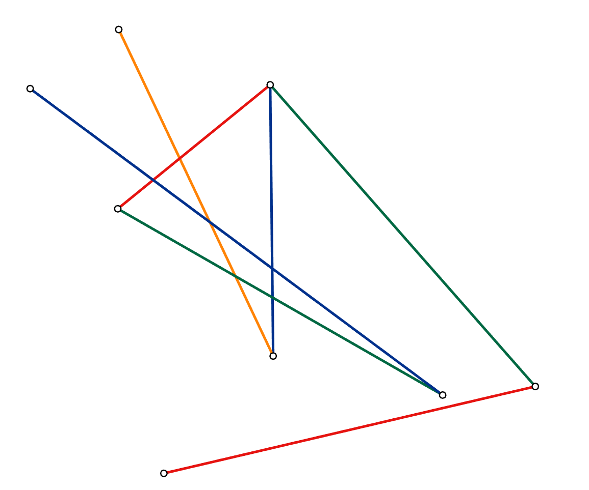
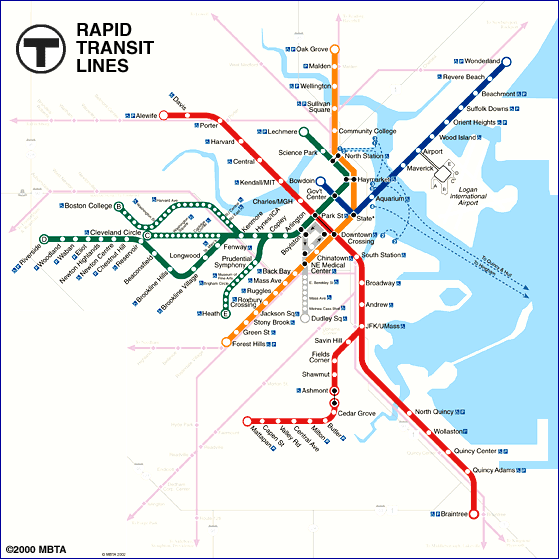
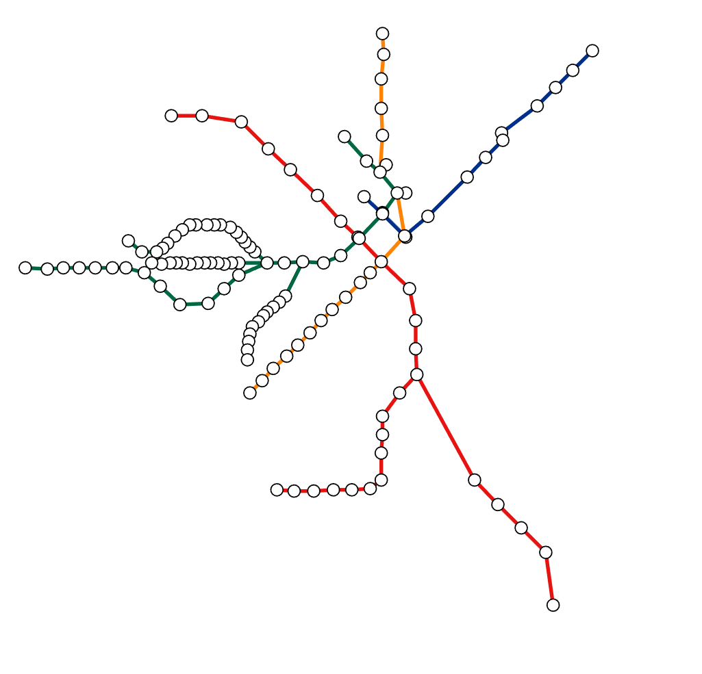
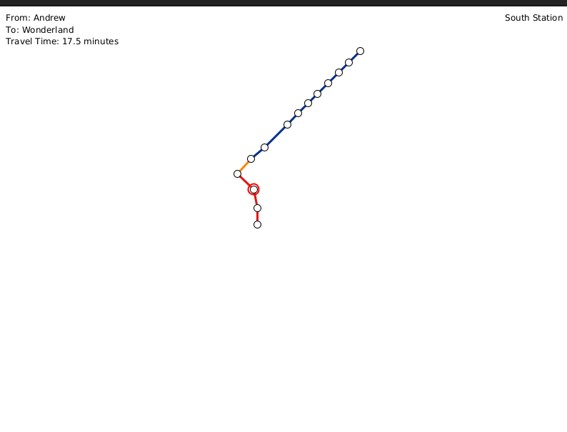
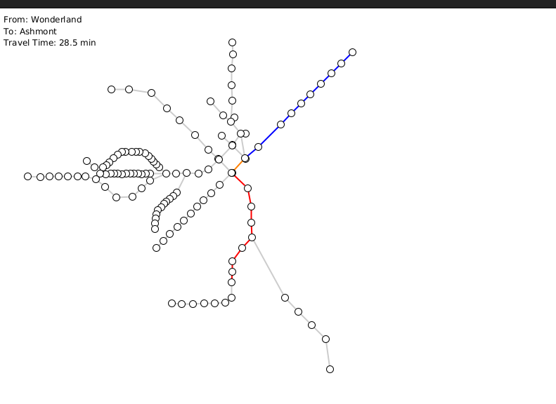

# HW4 - EECE 5642 Data Visualization

This repository contains the work done for Homework 4 of EECE 5642 Data Visualization, focusing on visualizing the Boston MBTA network using Processing.

## 1. Installing Processing on Linux

Before running the sketches, you need to have Processing installed on your Linux system. Follow these steps to install Processing:

### 1.1 Download Processing

1. Visit the Processing official website's download page: https://processing.org/download/
2. Select Linux 64-bit version (unless you're using a Raspberry Pi)
3. Download the .tgz file (e.g., `processing-x.x.x-linux64.tgz`)

### 1.2 Extract and Install

1. Open terminal (Ctrl+Alt+T)
2. Navigate to download directory:
   ```bash
   cd Downloads
   ```
3. Extract to /opt directory (recommended):
   ```bash
   sudo mkdir /opt/processing
   sudo tar -xvf processing-x.x.x-linux64.tgz -C /opt/processing
   ```

### 1.3 Create Desktop Launcher

1. Create a .desktop file:
   ```bash
   sudo gedit /usr/share/applications/processing.desktop
   ```

2. Add the following content (modify paths according to your installation):
   ```
   [Desktop Entry]
   Version=2.1
   Name=Processing
   Comment=Processing Rocks
   Exec=/opt/processing/processing-x.x.x/processing
   Icon=/opt/processing/processing-x.x.x/lib/icons/pde-256.png
   Terminal=false
   Type=Application
   Categories=AudioVideo;Video;Graphics;
   ```

### 1.4 Create Symbolic Link (Optional)

To run Processing from any terminal:
```bash
sudo ln -s /opt/processing/processing-x.x.x/processing /usr/local/bin/processing
```

### 1.5 Verify Installation

Test the installation by:
1. Running `processing` in terminal (if symbolic link was created)
2. Running directly: `/opt/processing/processing-x.x.x/processing`
3. Using the desktop launcher

## 2. Assignment Overview

The assignment involves creating a graph visualization of the Boston MBTA network using Processing. The T is modeled as an undirected graph, where stops are nodes/vertices and connections are edges. The assignment covers data acquisition from the web, data processing, and visualization techniques.

## 2. Folder Structure

The `HW4` folder contains the following subfolders and files:

- `HW4-EECE 5642.pdf`: The homework assignment PDF.
- `Ex_1_2_1/`: Contains the Processing sketch for Exercise 1.2.1.
- `Ex_1_2_2/`: Contains the Processing sketch for Exercise 1.2.2.
- `Ex_1_2_3/`: Contains the Processing sketch for Exercise 1.2.3.
- `Ex_1_2_4/`: Contains the Processing sketch for Exercise 1.2.4.
- `Ex_1_2_5/`: Contains the Processing sketch for Exercise 1.2.5.
- `TheTDataCollection/`: Contains Python scripts for data collection.
- `HW4-code/`: Contains additional Processing code files.

## 3. Code Usage

### Data Collection

The `TheTDataCollection` folder contains the following Python scripts:

- `stations.py`: Extracts the list of stations from the first table of `data.html`.
  - Output: `stations.csv` (list of station names, one per row)
- `connections.py`: Reads the connection data from the second table of `data.html`.
  - Output: `connections.csv` ("From", "To", "Color", "Minutes")

To run these scripts, you need to have Python installed. Navigate to the `TheTDataCollection` directory in your terminal and run the scripts:

```bash
cd HW4/TheTDataCollection
python3 stations.py
python3 connections.py
```

These scripts will generate the `stations.csv` and `connections.csv` files, which are used by the Processing sketches.

## 4. Exercise Descriptions

### 4.1 Ex_1_2_1: Adding Edge Colors

This exercise focuses on modifying the basic graph visualization framework to add color to the edges.

#### Code Implementation

- **Edge.pde:**
  ```java
  class Edge {
    Node from;
    Node to;
    String col; // Field to store the edge color

    Edge(Node from, Node to, String col) {
      this.from = from;
      this.to = to;
      this.col = col;
    }

    void draw() {
      // Convert color string to lowercase for case-insensitive comparison
      String colLower = col.toLowerCase();
      
      colorMode(HSB, 360, 100, 100);
      float hue = 0;
      
      // Set edge color based on the first letter of the color string
      if (colLower.charAt(0) == 'r') {
        hue = 0; // Red color for Red Line
      } else if (colLower.charAt(0) == 'g') {
        hue = 120; // Green color for Green Line
      } else if (colLower.charAt(0) == 'b') {
        hue = 240; // Blue color for Blue Line
      } else if (colLower.charAt(0) == 'o') {
        hue = 30; // Orange color for Orange Line
      }
      
      stroke(hue, 100, 100);
      strokeWeight(2);
      line(from.x, from.y, to.x, to.y);
      
      colorMode(RGB, 255);
    }
  }
  ```

- **Key Features:**
  - Added `col` field to store edge color
  - Modified constructor to accept color parameter
  - Implemented color mapping in `draw()` method
  - Used HSB color mode for better color control
  - Increased stroke weight for better visibility

- **Output:** The sketch displays a simple graph with colored edges.



### 4.2 Ex_1_2_2: Acquiring the Data

This exercise focuses on acquiring the data for the MBTA network from CSV files.

#### Code Implementation

- **stations.py:**
  ```python
  def parse_stations():
      with open('data.html', 'r') as f:
          soup = BeautifulSoup(f, 'html.parser')
          # Find the first table in the document
          table = soup.find('table')
          stations = []
          
          # Extract station names from table rows
          for row in table.find_all('tr')[1:]:  # Skip header row
              cols = row.find_all('td')
              if len(cols) > 0:
                  station = cols[0].text.strip()
                  stations.append(station)
                  
          # Write stations to CSV file
          with open('stations.csv', 'w') as out:
              for station in stations:
                  out.write(f"{station}\n")
  ```

- **Using_Your_Own_Data.pde:**
  ```java
  void setup() {
    size(800, 600);
    // Load station names from stations.csv
    Table stationsTable = new Table("stations.csv");
    
    // Create locations.csv with coordinates
    PrintWriter output = createWriter("locations.csv");
    for (int i = 0; i < stationsTable.getRowCount(); i++) {
      String stationName = stationsTable.getString(i, 0);
      float x = random(50, width-50);  // Random x coordinate
      float y = random(50, height-50); // Random y coordinate
      output.println(stationName + "," + x + "," + y);
    }
    output.flush();
    output.close();
  }
  ```

- **Key Features:**
  - Python script parses HTML table using BeautifulSoup
  - Extracts station names and writes to stations.csv
  - Processing sketch reads stations.csv
  - Generates random coordinates for each station
  - Creates locations.csv with station names and coordinates

- **Output:** The sketch generates a `locations.csv` file containing station names and coordinates.



### 4.3 Ex_1_2_3: Visualization of the Network

This exercise focuses on visualizing the MBTA network using the data acquired in the previous steps.

#### Code Implementation

- **Framework.pde:**
  ```java
  void loadData() {
    // Load locations.csv and connections.csv
    Table locationsTable = new Table("locations.csv");
    Table connectionsTable = new Table("connections.csv");
    
    // First load all nodes with their locations
    for (int i = 0; i < locationsTable.getRowCount(); i++) {
      String stationName = locationsTable.getString(i, 0);
      float x = locationsTable.getFloat(i, 1);
      float y = locationsTable.getFloat(i, 2);
      addNode(stationName, x, y);
    }
    
    // Then load all connections
    for (int i = 0; i < connectionsTable.getRowCount(); i++) {
      String fromStation = connectionsTable.getString(i, 0);
      String toStation = connectionsTable.getString(i, 1);
      String lineColor = connectionsTable.getString(i, 2);
      float minutes = connectionsTable.getFloat(i, 3);
      addEdge(fromStation, toStation, minutes, lineColor);
    }
  }

  void draw() {
    background(255);
    
    // Draw edges
    for (int i = 0; i < edgeCount; i++) {
      edges[i].draw();
    }
    
    // Draw nodes
    for (int i = 0; i < nodeCount; i++) {
      nodes[i].draw();
    }
    
    // Display station name on hover
    if (hoverNode != null) {
      fill(0);
      textAlign(RIGHT, TOP);
      text(hoverNode.label, width - 10, 10);
    }
  }
  ```

- **Key Features:**
  - Loads data from CSV files into tables
  - Creates nodes with proper coordinates
  - Creates edges with color and travel time
  - Implements hover functionality for station names
  - Uses clean visual design with white background

- **Output:** The sketch displays the MBTA network, with station names displayed when the mouse hovers over a station.



### 4.4 Ex_1_2_4: Shortest Path

This exercise focuses on implementing a shortest path algorithm to find the shortest path between two stations.

#### Code Implementation

- **ShortestPath.pde:**
  ```java
  float shortestPath(int start, int end) {
    // Initialize data structures
    float[] dist = new float[nodeCount];
    int[] prev = new int[nodeCount];
    boolean[] visited = new boolean[nodeCount];
    
    // Initialize distances
    for (int i = 0; i < nodeCount; i++) {
      dist[i] = Float.MAX_VALUE;
      prev[i] = -1;
    }
    dist[start] = 0;
    
    // Dijkstra's algorithm
    for (int i = 0; i < nodeCount; i++) {
      int u = minDistance(dist, visited);
      visited[u] = true;
      
      for (int v = 0; v < nodeCount; v++) {
        if (!visited[v] && adjacencyMatrix[u][v] > 0 && 
            dist[u] + adjacencyMatrix[u][v] < dist[v]) {
          dist[v] = dist[u] + adjacencyMatrix[u][v];
          prev[v] = u;
        }
      }
    }
    
    // Mark path
    markPath(start, end, prev);
    return dist[end];
  }

  void markPath(int start, int end, int[] prev) {
    // Reset active arrays
    Arrays.fill(activeNodes, false);
    Arrays.fill(activeEdges, false);
    
    // Mark nodes and edges on shortest path
    int current = end;
    while (current != start) {
      int previous = prev[current];
      activeNodes[current] = true;
      
      // Find and mark edge
      for (int i = 0; i < edgeCount; i++) {
        if ((edges[i].from.index == previous && edges[i].to.index == current) ||
            (edges[i].from.index == current && edges[i].to.index == previous)) {
          activeEdges[i] = true;
          break;
        }
      }
      current = previous;
    }
    activeNodes[start] = true;
  }
  ```

- **Key Features:**
  - Implements Dijkstra's shortest path algorithm
  - Uses adjacency matrix for graph representation
  - Tracks previous nodes for path reconstruction
  - Marks active nodes and edges on shortest path
  - Calculates total travel time

- **Output:** The sketch displays the MBTA network, with the shortest path between two selected stations highlighted. The travel time is displayed in the upper left corner.



### 4.5 Ex_1_2_5: Color Effect

This exercise focuses on adding a color effect to the non-active edges to highlight the shortest path.

#### Code Implementation

- **Edge.pde:**
  ```java
  class Edge {
    Integrator saturation;
    Integrator brightness;
    
    Edge(Node from, Node to, float minutes, String col) {
      this.from = from;
      this.to = to;
      this.minutes = minutes;
      this.col = col;
      
      saturation = new Integrator(1, 0.1, 0.1);
      brightness = new Integrator(1, 0.1, 0.1);
    }
    
    void draw() {
      String colLower = col.toLowerCase();
      colorMode(HSB, 360, 100, 100);
      float hue = 0;
      
      // Set edge color based on line
      if (colLower.charAt(0) == 'r') hue = 0;
      else if (colLower.charAt(0) == 'g') hue = 120;
      else if (colLower.charAt(0) == 'b') hue = 240;
      else if (colLower.charAt(0) == 'o') hue = 30;
      
      saturation.update();
      brightness.update();
      
      if (saturation.value == 0 && brightness.value == 0.8) {
        stroke(100); // Gray color for non-active edges
      } else {
        stroke(hue, saturation.value * 100, brightness.value * 100);
      }
      
      strokeWeight(2);
      line(from.x, from.y, to.x, to.y);
      colorMode(RGB, 255);
    }
  }
  ```

- **Framework.pde:**
  ```java
  void draw() {
    // Draw edges with color effect
    for (int i = 0; i < edgeCount; i++) {
      if (activeEdges == null || activeEdges[i]) {
        edges[i].saturation.target(1);
        edges[i].brightness.target(1);
      } else {
        edges[i].saturation.target(0);
        edges[i].brightness.target(0.8);
      }
      edges[i].draw();
    }
    
    // Draw all nodes
    for (int i = 0; i < nodeCount; i++) {
      nodes[i].draw();
    }
  }
  ```

- **Key Features:**
  - Uses Integrator class for smooth color transitions
  - Implements HSB color mode for better control
  - Animates saturation and brightness changes
  - Colors non-active edges in gray
  - Maintains visibility of all nodes

- **Output:** The sketch displays the MBTA network, with the shortest path highlighted and the non-active edges colored in gray.



## 5. Running the Sketches

Each `Ex_1_2_x` folder contains a Processing sketch that visualizes the MBTA network. To run these sketches:

1. Open the `.pde` file in the Processing IDE.
2. Ensure that the `stations.csv` and `connections.csv` files are located in the correct relative paths as specified in the code.
3. Run the sketch.

## 6. Conclusion

This homework assignment provided a comprehensive introduction to data visualization using Processing, covering data acquisition, data processing, and visualization techniques. The final result is an interactive visualization of the Boston MBTA network that allows users to find the shortest path between two stations.
